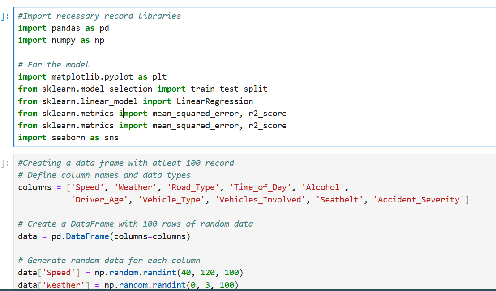

# Creating a linear regression model to analyze the accident severity
- Using jupyter notebook  # insall jupyter notebook
- install all the requirements
  - pip install pandas numpy matplotlib scilearn seaborn
- first clone this project
- git clone https://github.com/stoicdavi/DATASCIENCE.git
- cd DATASCIENCE/LinearRegresionModel
- to start the project
- run jopyter notebook # this is after making sure you are the projects directory
- run all the cells to see
# How it works

